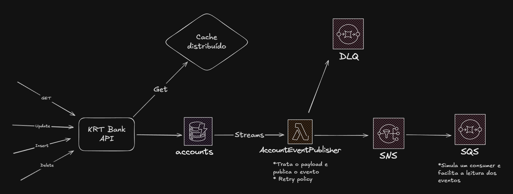

# KRT Bank

KRT Bank is an **account management API** developed in **.NET**, following **Domain-Driven Design (DDD)** principles, featuring **rich domains, value objects**, and **unit test implementations**.

This project was created as a technical challenge for **Act Digital**, with the goal of being allocated to **BTG Pactual**.

The system is designed for **CRUD** operations (GET, POST, PUT, DELETE) on accounts, with **distributed caching**, **asynchronous messaging**, and integration with AWS services.

The project also includes a Lambda function called **AccountEventPublisher**, responsible for publishing account creation, update, and deletion events to an AWS SNS topic.

---

## API Project Structure

The solution is organized into **5 main projects**, following a layered architecture:

* **KRTBank.API**: Presentation layer responsible for exposing REST API endpoints.
* **KRTBank.Application**: Contains application services and DTOs.
* **KRTBank.Domain**: Domain layer with the `Account` entity, value objects such as `CPF` and `HolderName`, and core business rules.
* **KRTBank.Infrastructure**: Repository implementations and integrations with DynamoDB and Redis.
* **KRTBank.Tests**: Unit tests that ensure greater application reliability.

---

## Features

* **Accounts CRUD**

  * **GET**: Retrieves accounts by Id using distributed cache (Redis).
  * **POST**: Creates new accounts.
  * **PUT**: Updates existing accounts.
  * **DELETE**: Removes accounts.

* **Distributed Cache**

  * Implemented with **Redis** via Docker.
  * Enables faster queries and prevents database overload, reducing read costs.

* **Database**

  * Uses **Amazon DynamoDB**.
  * DynamoDB Streams capture changes made to accounts.

* **Event-Driven Architecture**

  * Account changes trigger **streams** processed by an **AWS Lambda** (`AccountEventPublisher`).
  * The Lambda processes the payload and publishes events to an **SNS topic**, making them available to other systems.
  * In case of publishing failures, messages are sent to a **Dead Letter Queue (DLQ)**.

---

## Patterns and Best Practices

* **Domain-Driven Design (DDD)**

  * Rich domain centered around `Account`, ensuring internal state consistency through constructors.
  * Value Objects to enforce data validation and integrity.
  * `DomainException` is thrown whenever a domain validation fails.

* **Repository Pattern**

  * Clear separation between business/application logic and persistence.

* **Cache Aside Pattern**
 
   * Application first checks the cache for data; on a miss, it retrieves from the repository, stores it in the cache, and returns the result.

* **Options Pattern**

  * Redis configurations injected via `IOptions`, ensuring strong typing and compile-time validation.

* **Result Pattern**

  * Operations return result objects (`Result`) containing status and messages.

* **Testing**

  * Test coverage with **xUnit** and **Moq**, ensuring reliability for business and application rules.

---

## Architecture

**High-level flow:**

1. The API receives REST requests (`GET`, `POST`, `PUT`, `DELETE`).
2. Queries **Redis cache** for GET operations.
3. Persists and updates data in **DynamoDB**.
4. DynamoDB Streams trigger the **Lambda** (`AccountEventPublisher`).
5. The Lambda processes the payload and publishes events to **SNS**.
6. If an error occurs while publishing, the message is sent to a **DLQ**.

---

## Technologies

* **C# and .NET 8**
* **AWS DynamoDB**
* **AWS Lambda**
* **AWS SNS**
* **Redis (via Docker)**
* **Domain-Driven Design (DDD)**
* **xUnit + Moq**
* **Patterns:** Repository, Options, Result
